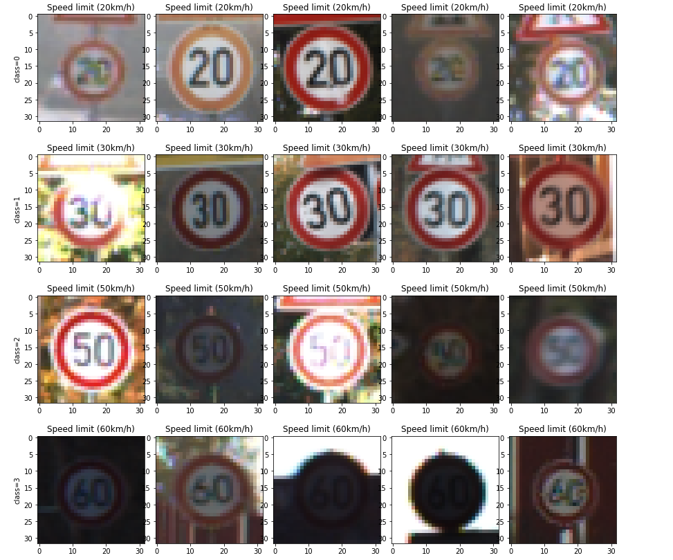
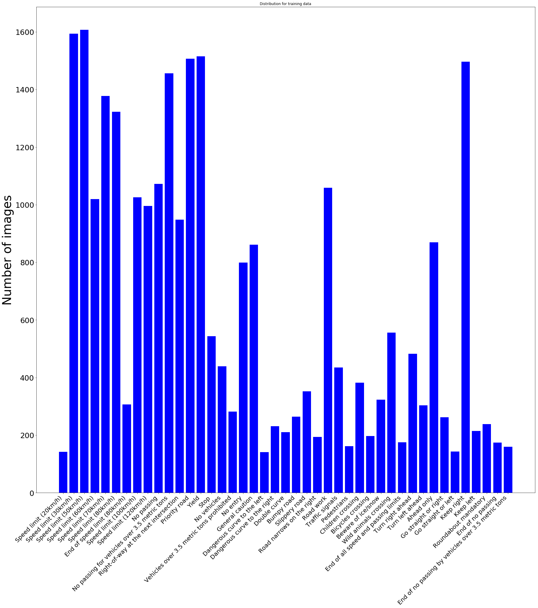
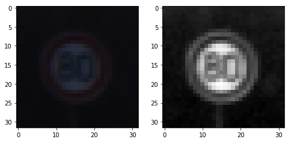
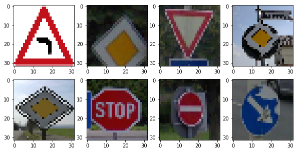

# **Traffic Sign Recognition** 

## Writeup

### You can use this file as a template for your writeup if you want to submit it as a markdown file, but feel free to use some other method and submit a pdf if you prefer.

---

**Build a Traffic Sign Recognition Project**

The goals / steps of this project are the following:
* Load the data set (see below for links to the project data set)
* Explore, summarize and visualize the data set
* Design, train and test a model architecture
* Use the model to make predictions on new images
* Analyze the softmax probabilities of the new images
* Summarize the results with a written report

[//]: # (Image References)

[image1]: ./examples/visualization.jpg "Visualization"
[image2]: ./examples/grayscale.jpg "Grayscaling"
[image3]: ./examples/random_noise.jpg "Random Noise"
[image4]: ./examples/placeholder.png "Traffic Sign 1"
[image5]: ./examples/placeholder.png "Traffic Sign 2"
[image6]: ./examples/placeholder.png "Traffic Sign 3"
[image7]: ./examples/placeholder.png "Traffic Sign 4"
[image8]: ./examples/placeholder.png "Traffic Sign 5"

## Rubric Points
### Here I will consider the [rubric points](https://review.udacity.com/#!/rubrics/481/view) individually and describe how I addressed each point in my implementation.  

---
### Writeup / README

includes the project code.

You're reading it! and here is a link to my [project code](https://github.com/udacity/CarND-Traffic-Sign-Classifier-Project/blob/master/Traffic_Sign_Classifier.ipynb)

### Data Set Summary & Exploration

I used the pandas library to calculate summary statistics of the traffic
I used pickle library to read the data, then using Sklearn library, I splitted the data into the validation set and training set.

* The size of training set is: 27839
* The size of the validation set is: 6960
* The size of test set is: 12630
* The shape of a traffic sign image is: 32x32x3
* The number of unique classes/labels in the data set is: 43

Here is an exploratory visualization of the data set. It is a sample of each class

 

Then, I plotted bar chart showing how many data per class are availabe

 

### Design and Test a Model Architecture

As a first step, I decided to use the original color of the images, and then compare the results with the grayscale image

Here is an example of a traffic sign image before and after grayscaling.

 

Based on my test experiment of the color and grayscale image, the accuracy was better for grayscale image.

As a last step, I normalized the image data because it makes it easier for optimizer to deal with the image data.

<!-- I decided to generate additional data because ... 

To add more data to the the data set, I used the following techniques because ... 

Here is an example of an original image and an augmented image:

![alt text][image3]

The difference between the original data set and the augmented data set is the following ... 
 -->

I used the LeNet architecture. I used two layers of convolution of the size of 5x5 and three fully connected layers.
My final model consisted of the following layers:

| Layer         		|     Description	        					| 
|:---------------------:|:---------------------------------------------:| 
| Input         		| 32x32x1 gray image   							| 
| Convolution1 5x5     	| 1x1 stride, VALID padding, outputs 28x28x32 	|
| RELU					|												|
| Max pooling	      	| 2x2 stride,  outputs 14x14x32 				|
| Convolution2 5x5     	| 1x1 stride, VALID padding, outputs 10x10x64 	|
| RELU					|												|
| Max pooling	      	| 2x2 stride,  outputs 5x5x64 				    |
| Flatten				| output = 1600									|
| Fully connected1		| input= 1600,  output = 400      				|
| RELU					|												|
| Fully connected2		| input= 400,  output = 200      				|
| RELU					|												|
| Fully connected3		| input= 200,  output = 43      				|

The model is trained by using the parameters below:

number of epochs: 20
Learning rate = 0.001
Batch size = 128

I used "AdamOptimizer" for type of optimizer. My final model Validation Accuracy was 0.961.
First I chose the LeNet architecture for UDACITY course, but the results wasn't good. The accuracy was around 0.7 (underfitting problem). To improve the accuracy, I adjusted the architecture by adjusting the number of features in each layer. 

<!-- #### 4. Describe the approach taken for finding a solution and getting the validation set accuracy to be at least 0.93. Include in the discussion the results on the training, validation and test sets and where in the code these were calculated. Your approach may have been an iterative process, in which case, outline the steps you took to get to the final solution and why you chose those steps. Perhaps your solution involved an already well known implementation or architecture. In this case, discuss why you think the architecture is suitable for the current problem.

My final model results were:
* training set accuracy of ?
* validation set accuracy of ? 
* test set accuracy of ?

If an iterative approach was chosen:
* What was the first architecture that was tried and why was it chosen?
* What were some problems with the initial architecture?
* How was the architecture adjusted and why was it adjusted? Typical adjustments could include choosing a different model architecture, adding or taking away layers (pooling, dropout, convolution, etc), using an activation function or changing the activation function. One common justification for adjusting an architecture would be due to overfitting or underfitting. A high accuracy on the training set but low accuracy on the validation set indicates over fitting; a low accuracy on both sets indicates under fitting.
* Which parameters were tuned? How were they adjusted and why?
* What are some of the important design choices and why were they chosen? For example, why might a convolution layer work well with this problem? How might a dropout layer help with creating a successful model?

If a well known architecture was chosen:
* What architecture was chosen?
* Why did you believe it would be relevant to the traffic sign application?
* How does the final model's accuracy on the training, validation and test set provide evidence that the model is working well?
  -->

### Test a Model on New Images

Here are five German traffic signs that I found on the web:

 

Among these 8 images, the second one is hard to classify probably because the part of the sign is not inside the frame.

Here are the results of the prediction:

| Image			        		|     Prediction	        					| 
|:-----------------------------:|:---------------------------------------------:| 
| Dangerous curve to the left   | Dangerous curve to the left   				| 
| Priority road     			| Turn right ahead 								|
| Yield							| Yield											|
| Priority road	      			| Priority road					 				|
| Priority road	      			| Priority road					 				|
| Stop	      					| stop							 				|
| No passing	      			| No passing					 				|
| Keep right	      			| Keep right					 				|

The model was able to correctly guess 7 of the 8 traffic signs, which gives an accuracy of 86%. 
<!-- This compares favorably to the accuracy on the test set of ... -->

The code for making predictions on my final model is located in the 11th cell of the Ipython notebook.

For the first image, the model is relatively sure that this is a Dangerous curve to the left sign (probability of 99.27), and the image does contain a Dangerous curve to the left sign. The top five soft max probabilities were

image1.png
Dangerous curve to the left = 74.81
Bumpy road = 13.40
Slippery road = 11.55
No passing = 0.22
Beware of ice/snow = 0.01

image2.jpg
Turn right ahead = 100.00
Speed limit (20km/h) = 0.00
Speed limit (30km/h) = 0.00
Speed limit (50km/h) = 0.00
Speed limit (60km/h) = 0.00

image3.jpg
Yield = 100.00
Speed limit (20km/h) = 0.00
Speed limit (30km/h) = 0.00
Speed limit (50km/h) = 0.00
Speed limit (60km/h) = 0.00

image4.png
Priority road = 99.98
Speed limit (50km/h) = 0.01
Roundabout mandatory = 0.00
No passing for vehicles over 3.5 metric tons = 0.00
End of all speed and passing limits = 0.00

image5.png
Priority road = 70.38
Yield = 22.63
No vehicles = 3.72
Speed limit (30km/h) = 1.75
Ahead only = 0.82

image6.jpg
Stop = 100.00
Speed limit (20km/h) = 0.00
Speed limit (30km/h) = 0.00
Speed limit (50km/h) = 0.00
Speed limit (60km/h) = 0.00

image7.jpg
No passing = 100.00
Speed limit (20km/h) = 0.00
Speed limit (30km/h) = 0.00
Speed limit (50km/h) = 0.00
Speed limit (60km/h) = 0.00

image8.jpg
Keep right = 100.00
Speed limit (20km/h) = 0.00
Speed limit (30km/h) = 0.00
Speed limit (50km/h) = 0.00
Speed limit (60km/h) = 0.00